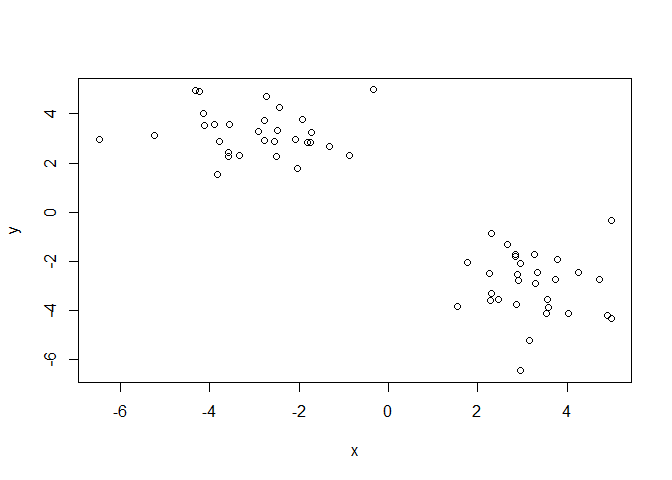
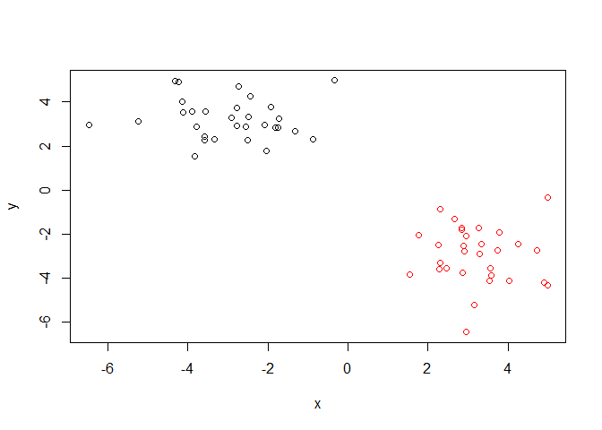
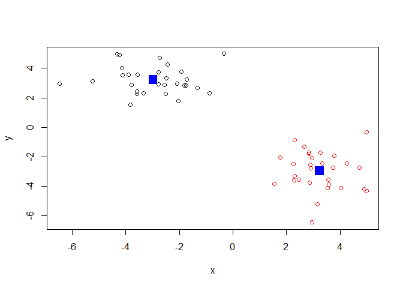
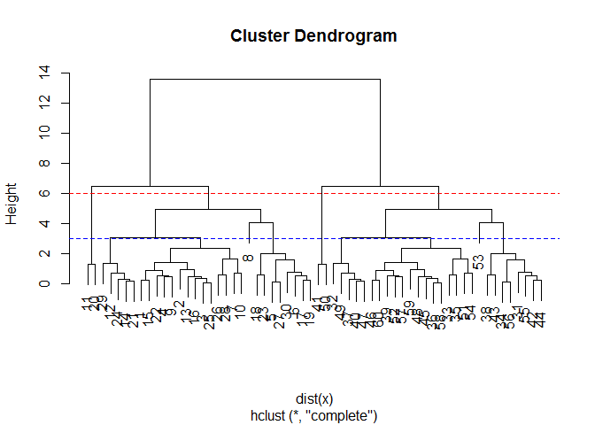
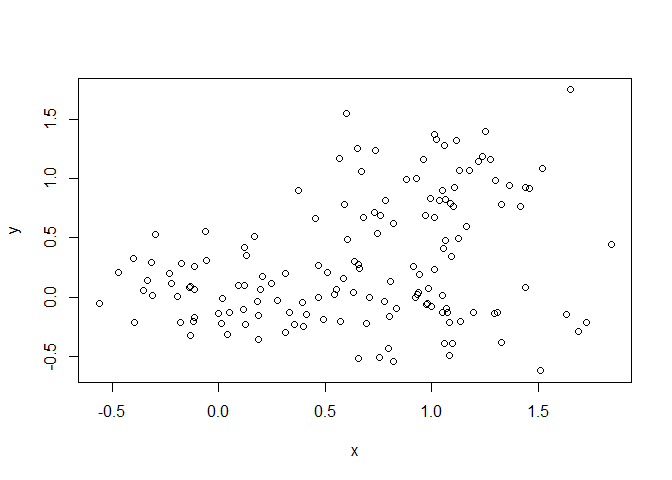
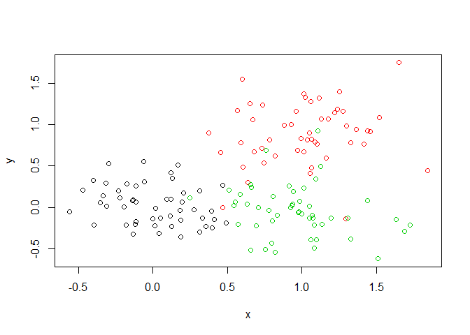
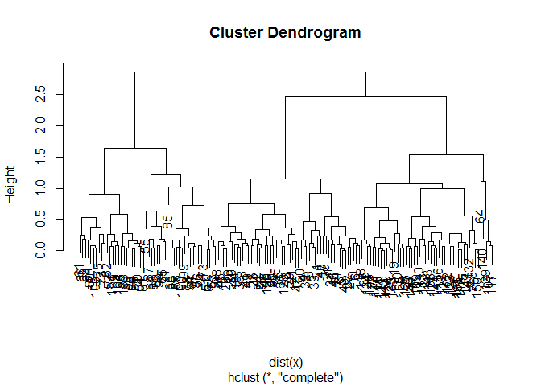
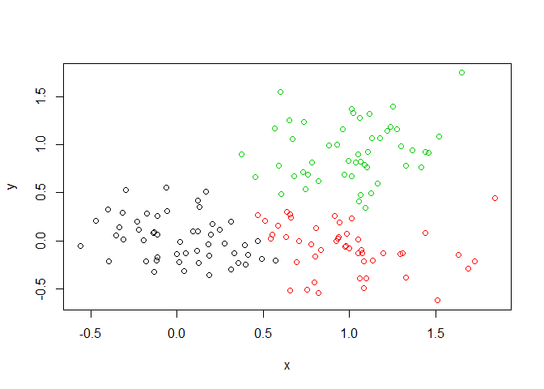

Class 09
================
Tiffany Chu
February 5, 2020

K-means clustering
------------------

Let's try the `kmeans()` function in R to cluster some made-up example data.

``` r
tmp <- c(rnorm(30, -3), rnorm(30, 3))
x <- cbind(x=tmp, y=rev(tmp))

plot(x)
```



Use the kmeans() function setting k to 2 and nstart=20

``` r
km <- kmeans(x, centers=2, nstart = 20)
```

Inspect/print the results

``` r
km
```

    ## K-means clustering with 2 clusters of sizes 30, 30
    ## 
    ## Cluster means:
    ##           x         y
    ## 1 -2.970883  3.227836
    ## 2  3.227836 -2.970883
    ## 
    ## Clustering vector:
    ##  [1] 1 1 1 1 1 1 1 1 1 1 1 1 1 1 1 1 1 1 1 1 1 1 1 1 1 1 1 1 1 1 2 2 2 2 2 2 2 2
    ## [39] 2 2 2 2 2 2 2 2 2 2 2 2 2 2 2 2 2 2 2 2 2 2
    ## 
    ## Within cluster sum of squares by cluster:
    ## [1] 73.16263 73.16263
    ##  (between_SS / total_SS =  88.7 %)
    ## 
    ## Available components:
    ## 
    ## [1] "cluster"      "centers"      "totss"        "withinss"     "tot.withinss"
    ## [6] "betweenss"    "size"         "iter"         "ifault"

Clustering vector gives whether points are in cluster 1 or cluster 2, since we asked for 2 clusters of size 30 each

What is in the output object `km` - I can use the `attributes()` function to find this info :-)

``` r
attributes(km)
```

    ## $names
    ## [1] "cluster"      "centers"      "totss"        "withinss"     "tot.withinss"
    ## [6] "betweenss"    "size"         "iter"         "ifault"      
    ## 
    ## $class
    ## [1] "kmeans"

Q. How many points are in each cluster?

``` r
km$size
```

    ## [1] 30 30

Q. What ‘component’ of your result object details - cluster size? - cluster assignment/membership - cluster center?

``` r
km$cluster
```

    ##  [1] 1 1 1 1 1 1 1 1 1 1 1 1 1 1 1 1 1 1 1 1 1 1 1 1 1 1 1 1 1 1 2 2 2 2 2 2 2 2
    ## [39] 2 2 2 2 2 2 2 2 2 2 2 2 2 2 2 2 2 2 2 2 2 2

Let's check how many 2s and 1s are in this vector with the `table()` function.

``` r
table(km$cluster)
```

    ## 
    ##  1  2 
    ## 30 30

Plot x colored by the kmeans cluster assignment

``` r
plot(x, col=km$cluster)
```



``` r
#c(rep("red", 30), rep("blue", 30))
#plot(x, col=km$cluster+2)
```

Plot x colored by the kmeans cluster assignment and add cluster centers as blue points

``` r
plot(x, col=km$cluster)
points(km$centers, col="blue", pch=15, cex=2)
```



Hierarchical clustering in R
----------------------------

The `hclus()` function is the main hierarchical clustering method in R ad it **must** be passed a *distance matrix* as an input, not your raw data!

``` r
hc <- hclust( dist(x) )
hc
```

    ## 
    ## Call:
    ## hclust(d = dist(x))
    ## 
    ## Cluster method   : complete 
    ## Distance         : euclidean 
    ## Number of objects: 60

``` r
plot(hc)
abline(h=6, col="red", lty=2)
abline(h=3, col="blue", lty=2)
```

 You can ask `cutree` for the `h` height to cut the tree.

``` r
cutree(hc, h=6)
```

    ##  [1] 1 1 1 1 1 1 1 1 1 1 2 1 1 1 1 1 1 1 1 2 1 1 1 1 1 1 1 1 1 1 3 3 3 3 3 3 3 3
    ## [39] 3 3 4 3 3 3 3 3 3 3 3 4 3 3 3 3 3 3 3 3 3 3

You can ask `cutree` for the `h` height to cut the tree, and use `table()` to list the number of groups

``` r
table( cutree(hc, h=3) )
```

    ## 
    ##  1  2  3  4  5  6  7  8  9 10 
    ## 14  8  1  2  5  8  5 14  2  1

You can also ask `cutree()` for the `k` number of groups that you want.

``` r
cutree(hc, k=5)
```

    ##  [1] 1 1 1 1 1 1 1 1 1 1 2 1 1 1 1 1 1 1 1 2 1 1 1 1 1 1 1 1 1 1 3 4 4 3 4 4 4 3
    ## [39] 4 4 5 3 3 3 4 4 4 4 4 5 4 4 3 4 3 3 4 4 4 4

Generate some made up random data that's a little more realistic and has overlap:

``` r
x<-rbind(
matrix(rnorm(100, mean=0, sd=0.3), ncol=2), # c1
matrix(rnorm(100, mean=1, sd=0.3), ncol=2), # c2
matrix(c(rnorm(50, mean=1, sd=0.3), # c3
         rnorm(50, mean=0, sd=0.3)), ncol=2))
colnames(x) <-c("x","y")

# Step 2. Plot the data without clustering
plot(x)
```



``` r
# Step 3. Generate colors for known clusters
#         (just so we can compare to hclust results)
col<-as.factor(rep(c("c1","c2","c3"), each=50) )
plot(x,col=col)
```



Q. Use the dist(), hclust(), plot() and cutree() functions to return 2 and 3 clusters

Remember, need to pass distance matrix to `hclust()`
====================================================

``` r
hc <- hclust( dist(x))
plot(hc)
```



``` r
grps3 <- cutree(hc, k=3)
grps3
```

    ##   [1] 1 1 1 1 1 1 1 1 1 1 2 1 1 1 1 1 1 1 1 1 1 1 1 1 1 1 1 1 1 1 1 1 1 1 1 1 1
    ##  [38] 1 1 1 1 1 1 1 1 1 1 1 1 1 3 3 3 3 3 3 3 3 2 3 3 3 3 2 3 3 3 3 3 3 3 3 3 3
    ##  [75] 3 2 3 3 3 3 3 3 3 3 3 3 3 3 3 1 3 3 3 3 3 3 3 3 3 3 2 2 3 3 2 2 2 2 2 2 3
    ## [112] 2 2 2 2 2 2 2 2 1 2 2 2 2 2 2 2 1 2 2 2 2 3 2 2 2 2 2 2 2 2 2 2 2 2 2 2 2
    ## [149] 2 2

``` r
table(grps3)
```

    ## grps3
    ##  1  2  3 
    ## 52 48 50

Q. How does this compare to your known 'col' groups?

``` r
plot(x, col=grps3)
```



Generate a cross-table: within clusters in grps3, how many come from c1, c2, or c3?

``` r
table(grps3, col)
```

    ##      col
    ## grps3 c1 c2 c3
    ##     1 49  1  2
    ##     2  1  3 44
    ##     3  0 46  4
