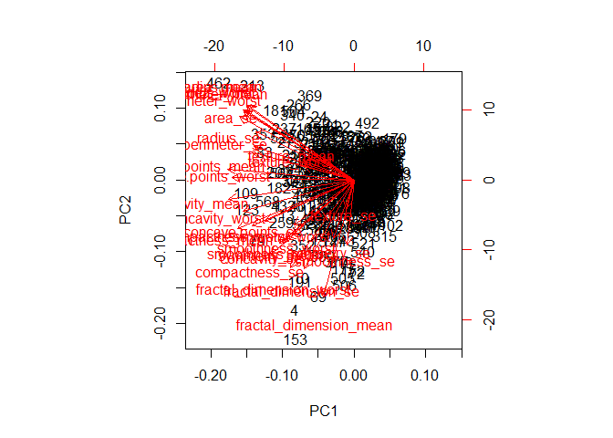
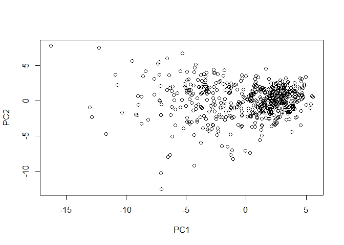
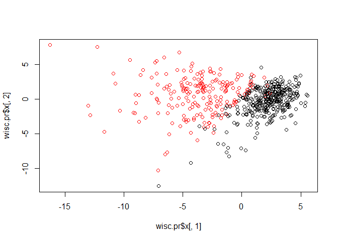
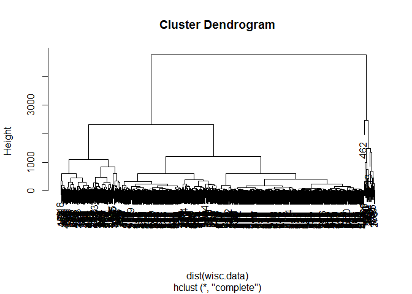
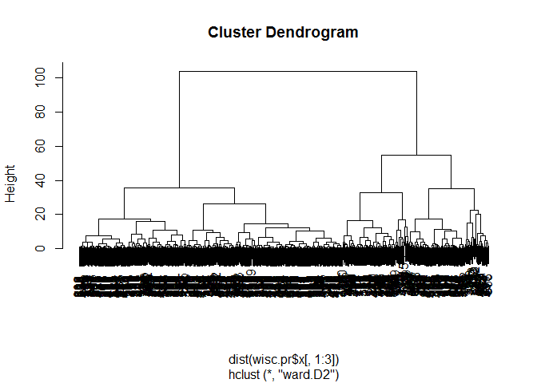
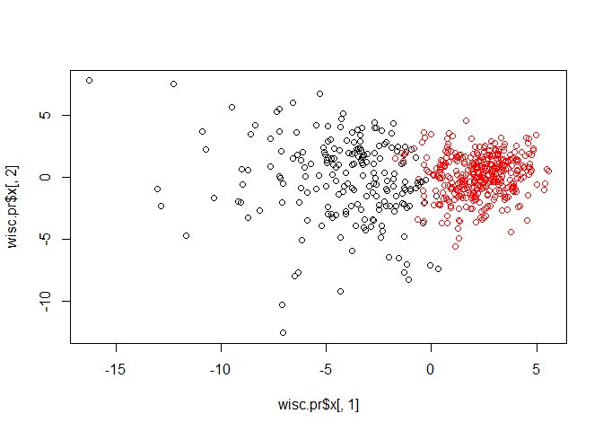
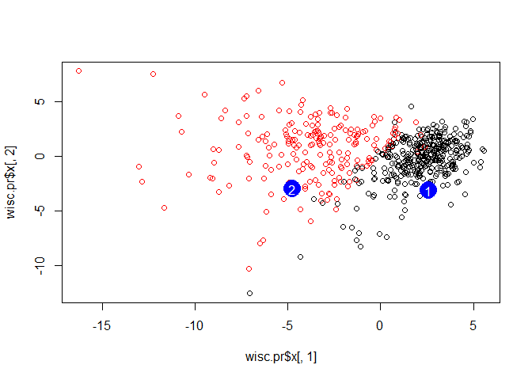

Class10 Machine Learning Project
================
Tiffany Chu
February 7, 2020

Get our input data
------------------

Our data for today comes from Madison, Wisconsin biopsies of breast tissue: the Wisconsin Breast Cancer Diagnostic Data Set

``` r
wisc.df <- read.csv("WisconsinCancer.csv")
head(wisc.df)
```

    ##         id diagnosis radius_mean texture_mean perimeter_mean area_mean
    ## 1   842302         M       17.99        10.38         122.80    1001.0
    ## 2   842517         M       20.57        17.77         132.90    1326.0
    ## 3 84300903         M       19.69        21.25         130.00    1203.0
    ## 4 84348301         M       11.42        20.38          77.58     386.1
    ## 5 84358402         M       20.29        14.34         135.10    1297.0
    ## 6   843786         M       12.45        15.70          82.57     477.1
    ##   smoothness_mean compactness_mean concavity_mean concave.points_mean
    ## 1         0.11840          0.27760         0.3001             0.14710
    ## 2         0.08474          0.07864         0.0869             0.07017
    ## 3         0.10960          0.15990         0.1974             0.12790
    ## 4         0.14250          0.28390         0.2414             0.10520
    ## 5         0.10030          0.13280         0.1980             0.10430
    ## 6         0.12780          0.17000         0.1578             0.08089
    ##   symmetry_mean fractal_dimension_mean radius_se texture_se perimeter_se
    ## 1        0.2419                0.07871    1.0950     0.9053        8.589
    ## 2        0.1812                0.05667    0.5435     0.7339        3.398
    ## 3        0.2069                0.05999    0.7456     0.7869        4.585
    ## 4        0.2597                0.09744    0.4956     1.1560        3.445
    ## 5        0.1809                0.05883    0.7572     0.7813        5.438
    ## 6        0.2087                0.07613    0.3345     0.8902        2.217
    ##   area_se smoothness_se compactness_se concavity_se concave.points_se
    ## 1  153.40      0.006399        0.04904      0.05373           0.01587
    ## 2   74.08      0.005225        0.01308      0.01860           0.01340
    ## 3   94.03      0.006150        0.04006      0.03832           0.02058
    ## 4   27.23      0.009110        0.07458      0.05661           0.01867
    ## 5   94.44      0.011490        0.02461      0.05688           0.01885
    ## 6   27.19      0.007510        0.03345      0.03672           0.01137
    ##   symmetry_se fractal_dimension_se radius_worst texture_worst perimeter_worst
    ## 1     0.03003             0.006193        25.38         17.33          184.60
    ## 2     0.01389             0.003532        24.99         23.41          158.80
    ## 3     0.02250             0.004571        23.57         25.53          152.50
    ## 4     0.05963             0.009208        14.91         26.50           98.87
    ## 5     0.01756             0.005115        22.54         16.67          152.20
    ## 6     0.02165             0.005082        15.47         23.75          103.40
    ##   area_worst smoothness_worst compactness_worst concavity_worst
    ## 1     2019.0           0.1622            0.6656          0.7119
    ## 2     1956.0           0.1238            0.1866          0.2416
    ## 3     1709.0           0.1444            0.4245          0.4504
    ## 4      567.7           0.2098            0.8663          0.6869
    ## 5     1575.0           0.1374            0.2050          0.4000
    ## 6      741.6           0.1791            0.5249          0.5355
    ##   concave.points_worst symmetry_worst fractal_dimension_worst  X
    ## 1               0.2654         0.4601                 0.11890 NA
    ## 2               0.1860         0.2750                 0.08902 NA
    ## 3               0.2430         0.3613                 0.08758 NA
    ## 4               0.2575         0.6638                 0.17300 NA
    ## 5               0.1625         0.2364                 0.07678 NA
    ## 6               0.1741         0.3985                 0.12440 NA

``` r
wisc.data <- as.matrix(wisc.df[,3:32])
head(wisc.data)
```

    ##      radius_mean texture_mean perimeter_mean area_mean smoothness_mean
    ## [1,]       17.99        10.38         122.80    1001.0         0.11840
    ## [2,]       20.57        17.77         132.90    1326.0         0.08474
    ## [3,]       19.69        21.25         130.00    1203.0         0.10960
    ## [4,]       11.42        20.38          77.58     386.1         0.14250
    ## [5,]       20.29        14.34         135.10    1297.0         0.10030
    ## [6,]       12.45        15.70          82.57     477.1         0.12780
    ##      compactness_mean concavity_mean concave.points_mean symmetry_mean
    ## [1,]          0.27760         0.3001             0.14710        0.2419
    ## [2,]          0.07864         0.0869             0.07017        0.1812
    ## [3,]          0.15990         0.1974             0.12790        0.2069
    ## [4,]          0.28390         0.2414             0.10520        0.2597
    ## [5,]          0.13280         0.1980             0.10430        0.1809
    ## [6,]          0.17000         0.1578             0.08089        0.2087
    ##      fractal_dimension_mean radius_se texture_se perimeter_se area_se
    ## [1,]                0.07871    1.0950     0.9053        8.589  153.40
    ## [2,]                0.05667    0.5435     0.7339        3.398   74.08
    ## [3,]                0.05999    0.7456     0.7869        4.585   94.03
    ## [4,]                0.09744    0.4956     1.1560        3.445   27.23
    ## [5,]                0.05883    0.7572     0.7813        5.438   94.44
    ## [6,]                0.07613    0.3345     0.8902        2.217   27.19
    ##      smoothness_se compactness_se concavity_se concave.points_se symmetry_se
    ## [1,]      0.006399        0.04904      0.05373           0.01587     0.03003
    ## [2,]      0.005225        0.01308      0.01860           0.01340     0.01389
    ## [3,]      0.006150        0.04006      0.03832           0.02058     0.02250
    ## [4,]      0.009110        0.07458      0.05661           0.01867     0.05963
    ## [5,]      0.011490        0.02461      0.05688           0.01885     0.01756
    ## [6,]      0.007510        0.03345      0.03672           0.01137     0.02165
    ##      fractal_dimension_se radius_worst texture_worst perimeter_worst area_worst
    ## [1,]             0.006193        25.38         17.33          184.60     2019.0
    ## [2,]             0.003532        24.99         23.41          158.80     1956.0
    ## [3,]             0.004571        23.57         25.53          152.50     1709.0
    ## [4,]             0.009208        14.91         26.50           98.87      567.7
    ## [5,]             0.005115        22.54         16.67          152.20     1575.0
    ## [6,]             0.005082        15.47         23.75          103.40      741.6
    ##      smoothness_worst compactness_worst concavity_worst concave.points_worst
    ## [1,]           0.1622            0.6656          0.7119               0.2654
    ## [2,]           0.1238            0.1866          0.2416               0.1860
    ## [3,]           0.1444            0.4245          0.4504               0.2430
    ## [4,]           0.2098            0.8663          0.6869               0.2575
    ## [5,]           0.1374            0.2050          0.4000               0.1625
    ## [6,]           0.1791            0.5249          0.5355               0.1741
    ##      symmetry_worst fractal_dimension_worst
    ## [1,]         0.4601                 0.11890
    ## [2,]         0.2750                 0.08902
    ## [3,]         0.3613                 0.08758
    ## [4,]         0.6638                 0.17300
    ## [5,]         0.2364                 0.07678
    ## [6,]         0.3985                 0.12440

Question. How many patients are there in this dataset?

``` r
nrow(wisc.data)
```

    ## [1] 569

Question. How many cancer and non-cancer patients are there? Answer. Column 2 has diagnosis, M for malignant and B for benign.

``` r
table(wisc.df$diagnosis)
```

    ## 
    ##   B   M 
    ## 357 212

alternatively

``` r
sum(wisc.df$diagnosis == "M")
```

    ## [1] 212

Question. How many of these columns give mean data?

``` r
colnames(wisc.df)
```

    ##  [1] "id"                      "diagnosis"              
    ##  [3] "radius_mean"             "texture_mean"           
    ##  [5] "perimeter_mean"          "area_mean"              
    ##  [7] "smoothness_mean"         "compactness_mean"       
    ##  [9] "concavity_mean"          "concave.points_mean"    
    ## [11] "symmetry_mean"           "fractal_dimension_mean" 
    ## [13] "radius_se"               "texture_se"             
    ## [15] "perimeter_se"            "area_se"                
    ## [17] "smoothness_se"           "compactness_se"         
    ## [19] "concavity_se"            "concave.points_se"      
    ## [21] "symmetry_se"             "fractal_dimension_se"   
    ## [23] "radius_worst"            "texture_worst"          
    ## [25] "perimeter_worst"         "area_worst"             
    ## [27] "smoothness_worst"        "compactness_worst"      
    ## [29] "concavity_worst"         "concave.points_worst"   
    ## [31] "symmetry_worst"          "fractal_dimension_worst"
    ## [33] "X"

Answer. `grep()` looks for pattern within vector.

``` r
grep("_mean", colnames(wisc.df))
```

    ##  [1]  3  4  5  6  7  8  9 10 11 12

`grep` returns location of match.

``` r
grep("_mean", colnames(wisc.df), value = TRUE)
```

    ##  [1] "radius_mean"            "texture_mean"           "perimeter_mean"        
    ##  [4] "area_mean"              "smoothness_mean"        "compactness_mean"      
    ##  [7] "concavity_mean"         "concave.points_mean"    "symmetry_mean"         
    ## [10] "fractal_dimension_mean"

Use `length()` to out how many matches - do not use `sum()` because sum will add up column location numbers.

``` r
length( grep("_mean", colnames(wisc.df)) )
```

    ## [1] 10

Enter Principle Component Analysis
----------------------------------

First we need to check whether our input data should be scaled. a) Look at mean values and standard deviation in each column - if they are not similar, we will need to scale. b) Use `sd()` and `mean()` to check all columns in `wisc.data` because `wisc.data` has been cleaned up and had irrelevant columns removed

``` r
round( apply(wisc.data, 2, sd), 2)
```

    ##             radius_mean            texture_mean          perimeter_mean 
    ##                    3.52                    4.30                   24.30 
    ##               area_mean         smoothness_mean        compactness_mean 
    ##                  351.91                    0.01                    0.05 
    ##          concavity_mean     concave.points_mean           symmetry_mean 
    ##                    0.08                    0.04                    0.03 
    ##  fractal_dimension_mean               radius_se              texture_se 
    ##                    0.01                    0.28                    0.55 
    ##            perimeter_se                 area_se           smoothness_se 
    ##                    2.02                   45.49                    0.00 
    ##          compactness_se            concavity_se       concave.points_se 
    ##                    0.02                    0.03                    0.01 
    ##             symmetry_se    fractal_dimension_se            radius_worst 
    ##                    0.01                    0.00                    4.83 
    ##           texture_worst         perimeter_worst              area_worst 
    ##                    6.15                   33.60                  569.36 
    ##        smoothness_worst       compactness_worst         concavity_worst 
    ##                    0.02                    0.16                    0.21 
    ##    concave.points_worst          symmetry_worst fractal_dimension_worst 
    ##                    0.07                    0.06                    0.02

Yes, data needs scaling.

``` r
#Perform PCA on wisc.data 
wisc.pr <- prcomp(wisc.data, scale=TRUE)
summary(wisc.pr)
```

    ## Importance of components:
    ##                           PC1    PC2     PC3     PC4     PC5     PC6     PC7
    ## Standard deviation     3.6444 2.3857 1.67867 1.40735 1.28403 1.09880 0.82172
    ## Proportion of Variance 0.4427 0.1897 0.09393 0.06602 0.05496 0.04025 0.02251
    ## Cumulative Proportion  0.4427 0.6324 0.72636 0.79239 0.84734 0.88759 0.91010
    ##                            PC8    PC9    PC10   PC11    PC12    PC13    PC14
    ## Standard deviation     0.69037 0.6457 0.59219 0.5421 0.51104 0.49128 0.39624
    ## Proportion of Variance 0.01589 0.0139 0.01169 0.0098 0.00871 0.00805 0.00523
    ## Cumulative Proportion  0.92598 0.9399 0.95157 0.9614 0.97007 0.97812 0.98335
    ##                           PC15    PC16    PC17    PC18    PC19    PC20   PC21
    ## Standard deviation     0.30681 0.28260 0.24372 0.22939 0.22244 0.17652 0.1731
    ## Proportion of Variance 0.00314 0.00266 0.00198 0.00175 0.00165 0.00104 0.0010
    ## Cumulative Proportion  0.98649 0.98915 0.99113 0.99288 0.99453 0.99557 0.9966
    ##                           PC22    PC23   PC24    PC25    PC26    PC27    PC28
    ## Standard deviation     0.16565 0.15602 0.1344 0.12442 0.09043 0.08307 0.03987
    ## Proportion of Variance 0.00091 0.00081 0.0006 0.00052 0.00027 0.00023 0.00005
    ## Cumulative Proportion  0.99749 0.99830 0.9989 0.99942 0.99969 0.99992 0.99997
    ##                           PC29    PC30
    ## Standard deviation     0.02736 0.01153
    ## Proportion of Variance 0.00002 0.00000
    ## Cumulative Proportion  1.00000 1.00000

Data is complex, so biplot does not return a useful description (very messy).

``` r
biplot(wisc.pr)
```



Let's make our own PCA plot. To do this, we need to figure out what is returned, so we will use `attributes()` to access the results within the `wisc.pr` object.

``` r
attributes(wisc.pr)
```

    ## $names
    ## [1] "sdev"     "rotation" "center"   "scale"    "x"       
    ## 
    ## $class
    ## [1] "prcomp"

Therefore, $x is where our data lives, where our principal components are stored as **columns** PC1, PC2, ...

We want $x component to make our PCA plot! Let's plot PC1:PC2

``` r
plot(wisc.pr$x[ ,1:2])
```



Let's color the points by diagnosis

``` r
plot(wisc.pr$x[,1], wisc.pr$x[,2], col=wisc.df$diagnosis)
```



Each point summarizes a patient, and PCA compresses data down to a lower dimension by focusing on the differences

Section 3: Hierarchical clustering
----------------------------------

Can we find a separation of cancer from non-cancer using a clustering method on the original input data?

Use the `hclust()` function on the `wisc.data` object that we used for PCA.

``` r
hc <- hclust( dist(wisc.data) )
plot(hc)
```



This tree isn't very helpful since we can't tell where is a good place to *cut* the tree.

We can cluster in PC space - that is, use the results of PCA to do the clustering:

``` r
wisc.pr.hc <- hclust( dist(wisc.pr$x[,1:3]), method="ward.D2")
plot(wisc.pr.hc)
```



``` r
grps <- cutree(wisc.pr.hc, k=2)
table(grps)
```

    ## grps
    ##   1   2 
    ## 203 366

``` r
table(grps, wisc.df$diagnosis)
```

    ##     
    ## grps   B   M
    ##    1  24 179
    ##    2 333  33

This tells us that in cluster 1, 24 members are benign and 179 members are malignant. So 24 are false negatives and 179 are true positives.

In cluster 2, 333 members are benign and 33 are malignant. So 33 are false positives.

Balance of sensitivity and specificity depends on what the data is.

``` r
plot(wisc.pr$x[,1], wisc.pr$x[,2], col=grps)
```



Section 7: Prediction
---------------------

We will use the `predict()` function that will take our PCA model from before and new cancer cell data and project that data onto our PCA space.

``` r
url <- "https://tinyurl.com/new-samples-CSV"
new <- read.csv(url)
npc <- predict(wisc.pr, newdata=new)
npc
```

    ##            PC1       PC2        PC3        PC4       PC5        PC6        PC7
    ## [1,]  2.576616 -3.135913  1.3990492 -0.7631950  2.781648 -0.8150185 -0.3959098
    ## [2,] -4.754928 -3.009033 -0.1660946 -0.6052952 -1.140698 -1.2189945  0.8193031
    ##             PC8       PC9       PC10      PC11      PC12      PC13     PC14
    ## [1,] -0.2307350 0.1029569 -0.9272861 0.3411457  0.375921 0.1610764 1.187882
    ## [2,] -0.3307423 0.5281896 -0.4855301 0.7173233 -1.185917 0.5893856 0.303029
    ##           PC15       PC16        PC17        PC18        PC19       PC20
    ## [1,] 0.3216974 -0.1743616 -0.07875393 -0.11207028 -0.08802955 -0.2495216
    ## [2,] 0.1299153  0.1448061 -0.40509706  0.06565549  0.25591230 -0.4289500
    ##            PC21       PC22       PC23       PC24        PC25         PC26
    ## [1,]  0.1228233 0.09358453 0.08347651  0.1223396  0.02124121  0.078884581
    ## [2,] -0.1224776 0.01732146 0.06316631 -0.2338618 -0.20755948 -0.009833238
    ##              PC27        PC28         PC29         PC30
    ## [1,]  0.220199544 -0.02946023 -0.015620933  0.005269029
    ## [2,] -0.001134152  0.09638361  0.002795349 -0.019015820

``` r
plot(wisc.pr$x[,1], wisc.pr$x[,2], col=wisc.df$diagnosis)
points(npc[,1], npc[,2], col="blue", pch=16, cex=3)
text(npc[,1], npc[,2], labels=c(1,2), col="white")
```


