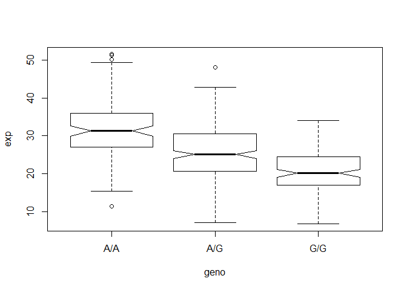

Class 15: Genotype Data
================

Read sample genotypes data from ENSEMBL
---------------------------------------

We downloaded genotype data from ENSEMBL on the MXL Mexican Ancestry in Los Angeles, California dataset.

``` r
mxl <- read.csv("373531-SampleGenotypes-Homo_sapiens_Variation_Sample_rs8067378.csv")
head(mxl)
```

    ##   Sample..Male.Female.Unknown. Genotype..forward.strand. Population.s. Father
    ## 1                  NA19648 (F)                       A|A ALL, AMR, MXL      -
    ## 2                  NA19649 (M)                       G|G ALL, AMR, MXL      -
    ## 3                  NA19651 (F)                       A|A ALL, AMR, MXL      -
    ## 4                  NA19652 (M)                       G|G ALL, AMR, MXL      -
    ## 5                  NA19654 (F)                       G|G ALL, AMR, MXL      -
    ## 6                  NA19655 (M)                       A|G ALL, AMR, MXL      -
    ##   Mother
    ## 1      -
    ## 2      -
    ## 3      -
    ## 4      -
    ## 5      -
    ## 6      -

Q. What proportion of this population are G/G, etc?

We want to look at the second column that contains the genotype information

``` r
table( mxl$Genotype..forward.strand. )
```

    ## 
    ## A|A A|G G|A G|G 
    ##  22  21  12   9

RNA-seq result analysis for different genotypes of this SNP.
------------------------------------------------------------

``` r
expr <- read.table("rs8067378_ENSG00000172057.6.txt")
head(expr)
```

    ##    sample geno      exp
    ## 1 HG00367  A/G 28.96038
    ## 2 NA20768  A/G 20.24449
    ## 3 HG00361  A/A 31.32628
    ## 4 HG00135  A/A 34.11169
    ## 5 NA18870  G/G 18.25141
    ## 6 NA11993  A/A 32.89721

``` r
# expr$geno == "G/G"
summary( expr[expr$geno == "G/G", ]$exp, breaks=20)
```

    ##    Min. 1st Qu.  Median    Mean 3rd Qu.    Max. 
    ##   6.675  16.903  20.074  20.594  24.457  33.956

We'll use the `boxplot()` function and the input data will be **expr**. How do we draw a useful plot?

``` r
boxplot(exp ~ geno, data=expr, notch=TRUE)
```



Q. How many individuals are in this data set?

``` r
# alternatively, can view in global eivironment, # of observations / rows
nrow(expr)
```

    ## [1] 462
